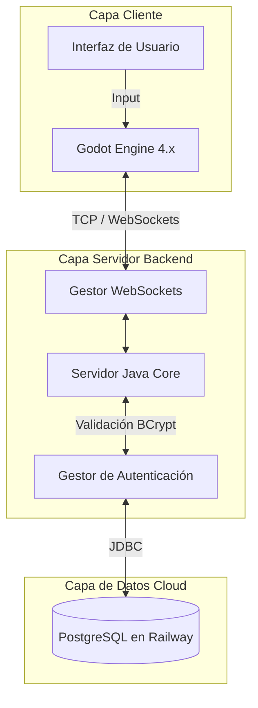

# 👑 Reino Pixel: MMORPG Cloud-Distributed Ecosystem

  
  
  
  
  

> **Reino Pixel** es un motor y ecosistema MMORPG de alto rendimiento diseñado desde cero para soportar concurrencia masiva en tiempo real. Combina la potencia gráfica y fluidez de un cliente moderno con un núcleo de servidor backend desacoplado, respaldado por una base de datos relacional robusta en la nube.

---

## 📑 Tabla de Contenidos

1. [¿De qué va este proyecto?](#-de-qué-va-este-proyecto)
2. [Arquitectura del Sistema](#-arquitectura-del-sistema)
3. [Stack Tecnológico](#️-stack-tecnológico-y-versiones)
4. [Características Principales](#-características-principales)
5. [Hoja de Ruta y Progreso](#️-hoja-de-ruta-y-progreso-fases-del-mmo)
6. [Datos Curiosos del Desarrollo](#-datos-curiosos-del-desarrollo)
7. [Licencia](#-licencia)

---

## ⚡ ¿De qué va este proyecto?

Este repositorio alberga la arquitectura completa de un juego multijugador masivo en línea (MMORPG) llamado **Reino Pixel**. Su diseño separa de manera estricta la **Capa Cliente (Godot Engine)** de la **Capa Servidor (Java WebSockets)** y la **Capa de Datos (PostgreSQL en Railway)**, garantizando una escalabilidad total, control absoluto sobre la infraestructura sin depender de servicios de terceros (BaaS), y una experiencia de usuario fluida con pantallas de carga dinámicas y bloqueo de hilos de interfaz.

---

## 📐 Arquitectura del Sistema

El ecosistema utiliza un patrón de diseño **Cliente-Servidor Autoritativo**. El cliente renderiza y predice, pero el servidor backend tiene siempre la última palabra sobre el estado del mundo y la validación de los datos.

## 🛠️ Stack Tecnológico y Versiones

| Componente | Tecnología | Versión | Propósito |
| :--- | :--- | :--- | :--- |
| **Cliente** | Godot Engine | `4.x Stable` | Interfaz gráfica, control de nodos, físicas 3D y renderizado. |
| **Servidor Core** | Java / Maven | `JDK 17+` | Servidor de red asíncrono basado en WebSockets. |
| **Librería de Red** | Java-WebSocket | `1.5.4` | Protocolo de comunicación bidireccional en tiempo real. |
| **Base de Datos** | PostgreSQL (Railway) | `JDBC 42.7+` | Persistencia en la nube de credenciales, perfiles y estado del mundo. |
| **Seguridad** | jBCrypt | `0.4` | Hashing industrial para encriptación segura de contraseñas. |

---

## 🚀 Características Principales

* **🔐 Autenticación Nativa y Segura:** Sistema de inicio de sesión (`AUTH:`) y registro (`REG:`) integrado directamente con PostgreSQL. El servidor encripta las contraseñas mediante **BCrypt**, garantizando que nunca se almacenen credenciales en texto plano.
* **🛡️ Seguridad de Hilos y UI:** Bloqueo inteligente de inputs de texto y botones durante las peticiones asíncronas para evitar estados de carrera o múltiples envíos.
* **📊 Barra de Progreso Dinámica:** Feedback visual en tiempo real con avance fluido hasta el 100% al completarse la sincronización de red.
* **🌐 Arquitectura Desacoplada:** Esquemas de base de datos SQL totalmente independientes del código de red en Java. Todo el flujo se centraliza mediante un `GestorAutenticacion` modular.
* **⚡ Baja Latencia:** Sincronización de coordenadas (`POS:`) optimizada mediante paquetes ligeros por WebSockets.

---

## 🗺️ Hoja de Ruta y Progreso (Fases del MMO)

El desarrollo sigue un orden cronológico estructurado para garantizar la estabilidad de la red antes de implementar mecánicas complejas:

### 🟢 FASE 1: El Núcleo Base (Completado)
* **[X]** Conexión Cliente-Servidor bidireccional (Godot ↔ Java WebSockets).
* **[X]** Interfaz de usuario dinámica con feedback visual y gestión de hilos.
* **[X]** Migración a base de datos relacional propia (PostgreSQL en Railway).
* **[X]** Seguridad de cuentas mediante hashing y salado de contraseñas (BCrypt).

### 🔴 FASE 2: La Expansión del Mundo (Próximos pasos)
* **[ ] Entidades y Posicionamiento:** Creación de la tabla `personajes` y sincronización continua de coordenadas espaciales (X, Y, Z) con persistencia en PostgreSQL.
* **[ ] Colisiones y Autoridad del Servidor:** Validación de físicas y movimientos estrictamente en el backend para prevenir *cheats* o atravesar estructuras.
* **[ ] Arquitectura Multiserver y Lobby:** Sala de espera central y enrutamiento a instancias sub-servidor para escalabilidad masiva.
* **[ ] Objetos y Sistema de Inventario:** Persistencia de ítems recogidos (Drop) y base de datos relacional de armamento y consumibles.
* **[ ] Mercado y Economía:** Implementación de divisas virtuales, validación de transacciones atómicas y *tradeo* seguro entre jugadores para evitar duplicación de ítems.

---

## 🔮 Datos Curiosos del Desarrollo

* 🧠 **Cero pérdidas de memoria:** El servidor gestiona las sesiones activas mediante un `HashMap` optimizado que limpia automáticamente las conexiones huérfanas al cerrar el socket.
* ☁️ **Independencia de hardware (Twelve-Factor App):** Gracias a la lectura dinámica de variables de entorno (`System.getenv`), el servidor Java adapta sus credenciales automáticamente ya sea ejecutándose en local o desplegado en producción (Railway), manteniendo el código fuente libre de secretos.
* 🎨 **UX resiliente:** Si un inicio de sesión falla por credenciales inválidas, el cliente reactiva automáticamente todos los controles de la interfaz en menos de un milisegundo para permitir un nuevo intento.

---

## 📄 Licencia

Este proyecto está bajo la Licencia **MIT**. Eres libre de usar, modificar y distribuir el código, siempre y cuando se incluya la licencia original.

  <i>Desarrollado con arquitectura limpia, pasión por el código comentado y visión de futuro. 🚀</i>

