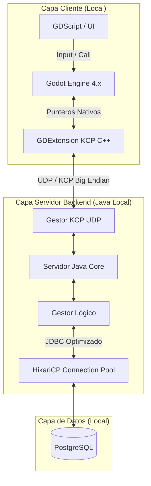

# 👑 Reino Pixel: MMORPG High-Performance Ecosystem

  
  
  
  
  

> **Reino Pixel** es un motor y ecosistema MMORPG de alto rendimiento diseñado desde cero para soportar concurrencia masiva en tiempo real. Abandona las arquitecturas web tradicionales para abrazar un núcleo de red nativo basado en **UDP/KCP**, combinando la potencia gráfica de Godot 4 con un servidor backend en Java ultrarrápido y una base de datos local optimizada.

---

## 📑 Tabla de Contenidos

1. [¿De qué va este proyecto?](#-de-qué-va-este-proyecto)
2. [Arquitectura del Sistema](#-arquitectura-del-sistema)
3. [Stack Tecnológico](#️-stack-tecnológico-y-versiones)
4. [Características Principales](#-características-principales)
5. [Hoja de Ruta y Progreso](#️-hoja-de-ruta-y-progreso-fases-del-mmo)
6. [Datos Curiosos del Desarrollo](#-datos-curiosos-del-desarrollo)
7. [Licencia](#-licencia)

---

## ⚡ ¿De qué va este proyecto?

Este repositorio alberga la arquitectura de red y el ecosistema completo de un juego multijugador masivo en línea (MMORPG) llamado **Reino Pixel**. 

Su diseño ha sido iterado para separar de manera estricta la **Capa Cliente (Godot Engine + GDExtension en C++)** de la **Capa Servidor (Java)** y la **Capa de Datos (PostgreSQL Local + HikariCP)**. Al descartar WebSockets y TCP en favor del protocolo KCP, el juego logra una transmisión de paquetes binarios inmediata (Big Endian), garantizando latencia cero en el movimiento y combate.

---

## 📐 Arquitectura del Sistema

El ecosistema utiliza un patrón de diseño **Cliente-Servidor Autoritativo** de alta velocidad. El cliente delega todo el procesamiento de red a una librería nativa compilada, mientras el servidor backend mantiene la autoridad sobre el estado del mundo.

## 🚀 Características Principales

* **🏎️ Red Nativa (GDExtension):** El cliente de Godot no gestiona los sockets directamente. Delega el trabajo pesado a una librería binaria en C++, evitando bloqueos en el hilo principal de renderizado de GDScript.
* **📦 Serialización Binaria (Big Endian):** Eliminación total de JSON y strings para el tráfico de red. Todos los datos (Opcodes, floats, strings) viajan comprimidos en arrays de bytes (`PackedByteArray`) para maximizar el ancho de banda.
* **🔌 Connection Pooling:** El servidor Java utiliza HikariCP para mantener un *pool* de 20 conexiones a PostgreSQL pre-abiertas y en caché, logrando tiempos de respuesta de microsegundos en cada petición (Login, Load, Save).
* **🌐 Entorno de Alta Iteración:** Despliegue 100% local (localhost) para la fase de desarrollo, permitiendo compilar, reiniciar y testear cambios en el servidor Java y la base de datos en menos de 2 segundos.
* **🛡️ Arquitectura Desacoplada:** El código está fuertemente modularizado, con scripts de GDScript que únicamente invocan señales nativas del cliente KCP, y un servidor Java que separa la red de la lógica de base de datos.

---

## 🗺️ Hoja de Ruta y Progreso (Fases del MMO)

El desarrollo sigue un orden cronológico estructurado para garantizar la estabilidad de la red antes de implementar mecánicas complejas:

### 🟢 FASE 1: La Evolución de la Red (Completado)
* **[X]** Integración de C++ en Godot mediante sistema de compilación SCons.
* **[X]** Creación y enlace de la librería nativa `KCPClient.dll` (GDExtension).
* **[X]** Reestructuración del Singleton de red en GDScript para usar Opcodes binarios.
* **[X]** Migración de la base de datos a PostgreSQL local para optimización de desarrollo.
* **[X]** Implementación de HikariCP en Java para concurrencia masiva.

### 🟢 FASE 2: El Núcleo del Servidor KCP
* **[X] Implementación KCP en Java:** Reestructurar el *Server Core* para utilizar Netty (o similar) y habilitar la recepción/desencriptación de paquetes UDP enviados por Godot.
* **[X] Handshake y Autenticación:** Readaptar el sistema de Login/Registro para que responda a los nuevos Opcodes binarios (Big Endian).
* **[X] Entidades y Posicionamiento:** Creación de la tabla `personajes` y sincronización continua de coordenadas espaciales (X, Y, Z) a través de KCP.

### 🔴 FASE 3: El Núcleo del Servidor KCP (Próximos pasos)
* **[ ] Persistencia de posiciones:** Implementar la lógica en la base de datos y guardar la posición del jugador en el mundo
* **[ ] Perfeccionamiento de interfaces:** Terminar de desarrollar las interfaces, dejandolas funcionales al 100%.
* **[ ] Menu de juego:** Creación del menú dentro de juego y lógica de tal.

### 🟣 FASE 4: La Expansión del Mundo
* **[ ] Colisiones y Autoridad del Servidor:** Validación de físicas y movimientos estrictamente en el backend.
* **[ ] Objetos y Sistema de Inventario:** Persistencia de ítems recogidos y base de datos relacional de armamento.
* **[ ] Mercado y Economía:** Implementación de divisas virtuales, validación de transacciones y *tradeo* seguro.

---

## 🔮 Datos Curiosos del Desarrollo

* 🚀 **Adiós a los WebSockets:** El proyecto comenzó utilizando WebSockets sobre TCP. Al descubrir las necesidades reales de un MMORPG (movimiento en tiempo real), se reescribió toda la capa de red del cliente en C++ puro en tiempo récord.
* 🧠 **Punteros Nativos:** La clase `KCPClient` en Godot no es un script, es un objeto que reside directamente en la memoria RAM gestionada por C++, lo que la hace cientos de veces más rápida que el código interpretado.
* ⚡ **Latencia vs Fiabilidad:** KCP es un protocolo que sacrifica parte del ancho de banda (enviando ACKs constantes) a cambio de reducir la latencia de retransmisión al mínimo absoluto, la técnica exacta que usan juegos como *Genshin Impact* o *Valorant*.

---

## 📄 Licencia

Este proyecto está bajo la Licencia **MIT**. Eres libre de usar, modificar y distribuir el código, siempre y cuando se incluya la licencia original.
